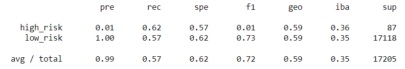

# Credit_Risk_Analysis
Module 17 Challenge: Machine Learning

## Overview
For this challenge, Jill asked us to assess individuals' credit card riskby considering their loan payment history/status. We used machine learning models to evaluate the individuals and make determinations on their credit card risk. 

* I was not able to get my code to work for Deliverable 3, but I don't know why.

## Results 
The images below display the acuuracy/precision data for 4/6 models I was able to successfully run.
1. Naive Random Oversampling

2. SMOTE Oversampling

3. Undersampling

4.Combination

5.Balanced Random Forest Classifier (missing)
6. Easy Ensemble AdaBoost Classifier (missing)

Observations:
* The oversampling models share the same level of precision and accuracy/recall for both classes of potential credit card holders. It correctly identifies high risk credit card applicants 60% of the time and correctly identifies low risk applicants 68% of the time.
* The undersampling model shares the same level of precision as all of the other successfully completed models; however, it is distinct in its accuracy.62% of the time it accurately determined high risk applicants. 57% of the time it accurately determined low risk applicants. 
* The combination model was as precise as the other successfully produced models, but its accuracy was slightly higher than the oversampling and undersampling models. The model accurately determined high risk individuals 70% of the time, and accurately classified low risk individuals 57% of the time.

## Summary
Given the risk associated to Jill's company for giving credit cards to high risk individuals it is most important to ensure that these people are accurately identified within the model, outweighing the importance of identifying low risk individuals and having a precise model. Given this fact, I would recommend the combination model be utilized. This model possessed the highest accuracy for identifying high risk individuals.

This summary is subject to change upon successfully running the final two models from Deliverable 3 :(
